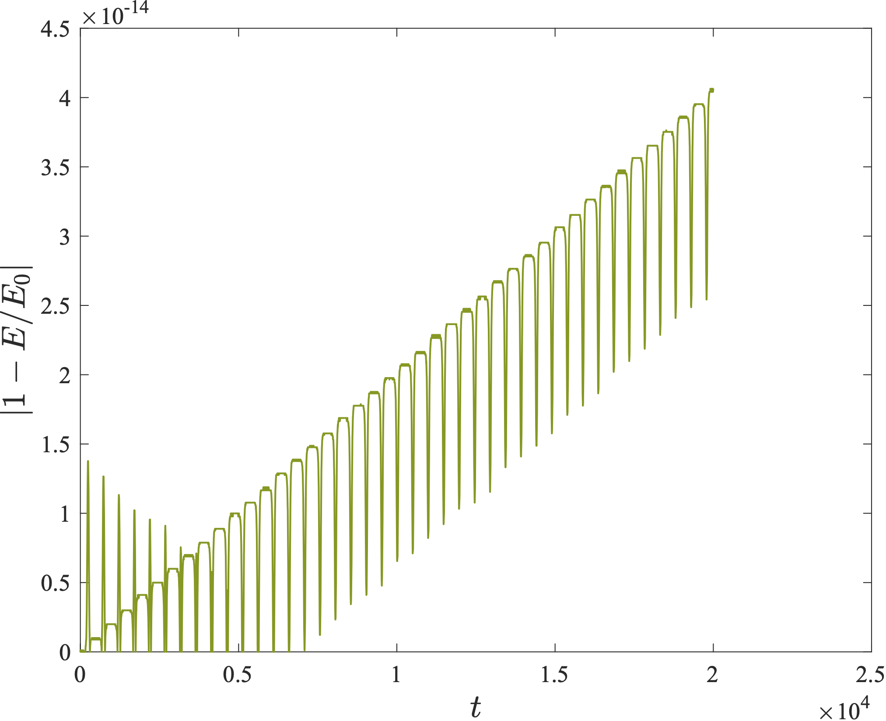
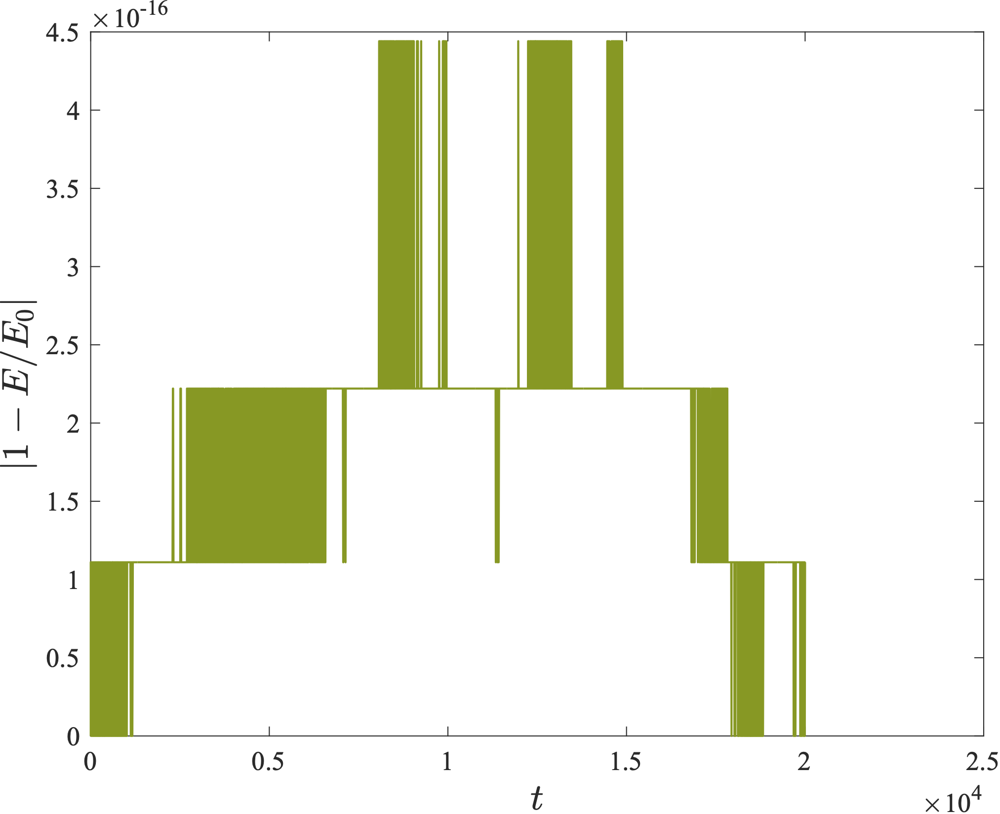
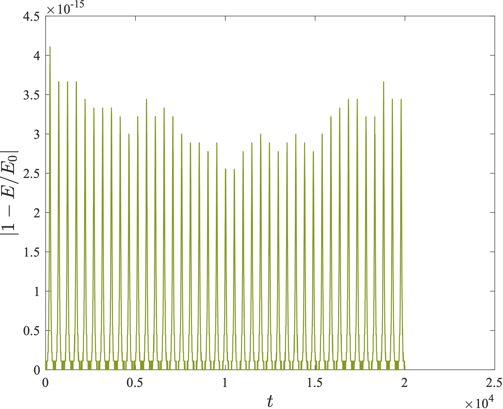

## Hamiltonian

Our model is based on the Hamiltonian presented in Ref. [^1]. However, we introduced minor differences with respect to the structure presented in the paper:

- For the potential $A_{\rm orb}$ we use the $a_6^c$ tuning of Ref. [^2] (Eqs. 33-38 therein). 
- For the function $Q_4$ we exploit the expression in Eq. (2.37) of Ref. [^3]. 
- The NNLO-accurate gyro-gravitomagnetic factors $g_S^{\rm eff}, g_{S^*}^{\rm eff}$ are replaced with the updated N3LO result (in the Damour-Jaranowski-Schäfer gauge). The latter can be found in Eqs. (5.6a, b) of Ref. [^4]. 

## Canonical spin variables

The Hamiltonian is a function of coordinates $\vec{r} = \\{ x, y, z \\}$ and momenta $\vec{p} = \\{ p_x, p_y, p_z \\}$, and of the spins $\vec{\chi}\_i = \\{ \chi_{i,x}, \chi_{i,y}, \chi_{i,z} \\}$ for $i = 1, 2$. While coordinates and momenta are canonical, the spins are not. In order to evolve a fully symplectic system, we transform the spins to:
 
$\alpha_i = \arctan (\chi_{i,y} / \chi_{i,x})$  
$\xi_i = \chi_{i,z} / |\vec{\chi}_i|$

for $i = 1,2$. This was done for instance in Ref. [^5], and originally proposed in Ref. [^6].

## Integration scheme and time transformation

The code is provided with a 4th-order Runge-Kutta solver and with a 6th-order three-stage Gauss-Legendre Runge-Kutta collocation solver [^7], and we recommend the latter for higher accuracy. Furthermore, we also implement a generalized Sundman transformation [^8] of the form $dt = g(r) ds$, with $g(r) = r^3$ [^9]. This transformation allows the time step to be larger at apoapsis (where high resolution is less needed), and smaller at periapsis, and the choice of $g(r)$ is related to the fact that spin-orbit interaction is proportional to $1/r^3$, being stronger at periapsis. The system is then evolved with additional (canonical) variables $t, p_t = -H_0$ with a fixed timestep $ds$. While providing a similar accuracy to simply using $dt = 0.1$ with the 6th-order three-stage Gauss-Legendre Runge-Kutta, the transformed time step (with $ds = 10^{-4}$) halves the computational time. Below we show the energy conservation over a total integration time $t = 20 000$ for three cases: 4th-order Runge-Kutta, 6th-order three-stage Gauss-Legendre Runge-Kutta with standard step size, 6th-order three-stage Gauss-Legendre Runge-Kutta with the generalized Sundman transformation. 

| RK4 | GL-RK6, dt | 
| :---: | :---: |
|  |  | 

| GL-RK6, ds |
| :---: |
|  |

## References

[^1]: https://inspirehep.net/literature/1395081
[^2]: https://inspirehep.net/literature/1777194
[^3]: https://inspirehep.net/literature/553839
[^4]: https://inspirehep.net/literature/1821432
[^5]: https://inspirehep.net/literature/1220319
[^6]: https://inspirehep.net/literature/852991
[^7]: https://link.springer.com/book/10.1007/978-3-662-05018-7
[^8]: https://link.springer.com/article/10.1007/BF02422379
[^9]: https://link.springer.com/article/10.1007/BF01231102